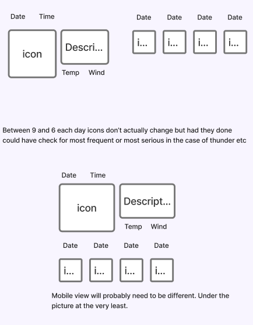
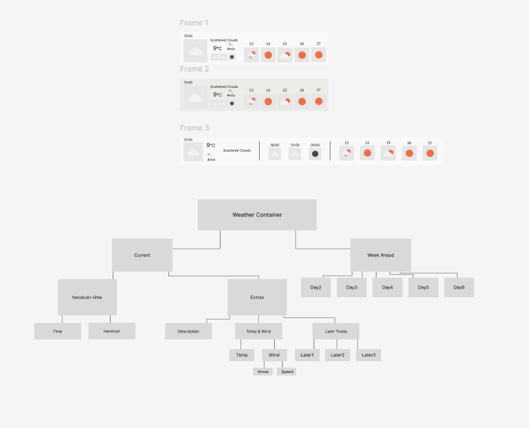
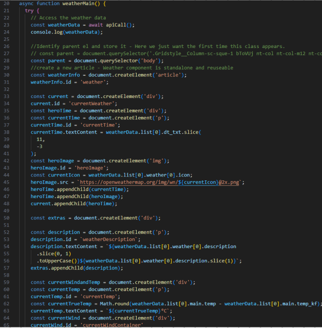
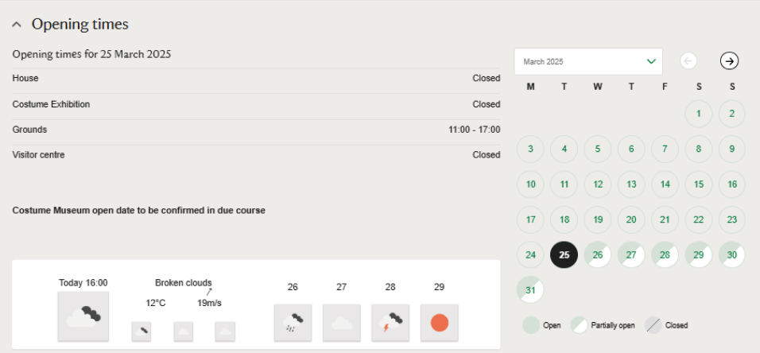

# Weather Widget

A lightweight, embeddable weather widget built with React.

## Features
- Dynamic location detection from NT property Google Maps links
- Weather forecasts for each property
- Fallback to The Pineapple 🍍 if location not found
- Secure headers and content delivery
- Proper React/ReactDOM loading management
- Compass feature to provide alt text to wind direction

## Implementation Journey

### 1. Initial Research & Planning
- Analyzed API data (40 time slots, 3-hour intervals)
- Researched weather data points (temp_kf vs temp)
- Discovered built-in icon system
- Created initial wireframes and designs

### 2. Development Evolution
1. **Vanilla JavaScript Prototype**
   - Pure DOM manipulation approach
   - Simple but limiting for complex UI
   - Learned valuable lessons about script injection

2. **React Implementation**
   - Moved to React for better component structure
   - Explored webpack configurations
   - Settled on Vite for smoother bundling

3. **Explored IFrame Approach**
   - Attempted for isolation
   - Added unnecessary complexity
   - Abandoned for cleaner script injection

4. **Final Implementation**
   - Direct script embedding
   - Clean location detection
   - Proper React/ReactDOM loading
   - The Pineapple 🍍 fallback solution

### Development Screenshots







### Current Implementation
The widget uses direct script embedding with managed dependencies:
```html
<script src="https://weather-widget-pied.vercel.app/embed/widget.js"></script>
```

### Location Handling
The widget extracts coordinates from National Trust property pages:
```javascript
// From property's "Get Directions" link
destination=54.68729%2C-6.657566
```

Fallback Location:
- The Pineapple, Dunmore (56.0729, -3.8326)
- A folly built in 1761 near Airth, Scotland


## Technical Details
- React 18.3.1
- Types from [openweathermap-ts](https://www.npmjs.com/package/openweathermap-ts)
- Security headers and content type enforcement

## Usage & Development
Add to any HTML page:
```html
<script src="https://weather-widget-pied.vercel.app/embed/widget.js"></script>

# Weather Widget

// ...existing code...

## Development

### Setup
1. Clone the repository:
```bash
git clone https://github.com/yourusername/weatherWidget.git
cd weatherWidget
```

2. Install dependencies:
```bash
npm install
```

3. Start development server:
```bash
npm run dev
```

4. Build for production:
```bash
npm run build
```

### Testing Locally
1. Build the project
2. Check the widget in `dist/embed/example.html`
3. Verify script loading in browser dev tools

