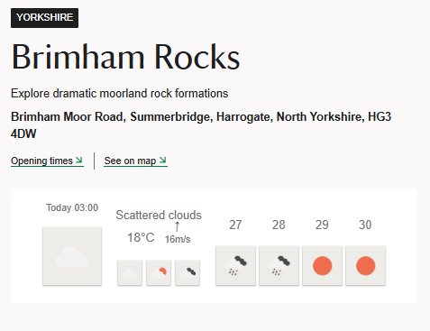
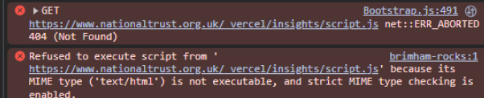
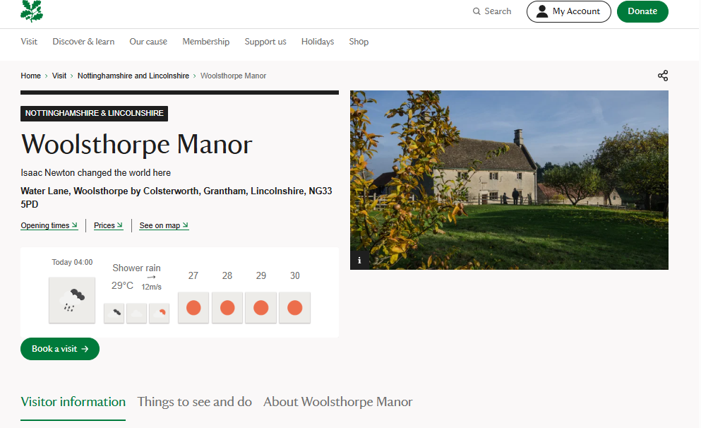

# Weather Widget


## Overview
A lightweight, embeddable weather widget built with React for National Trust property pages.

## Quick Start
```html
<script src="https://weather-widget-one-roan.vercel.app/embed/widget.js"></script>
```

- [Features](#features)
- [Analytics](#analytics)
- [User Interactions](#user-interactions)
- [Implementation](#implementation)
- [Technical Details](#technical-details)
- [Developers](#developers)
- [The Process in Pics]{#the-process-in-pics}


## Features
- Weather forecasts for NT properties
- Dynamic location detection from Google Maps links
- Compass feature for wind direction
- User interaction analytics
- Fallback to Castle Drogo if location not found

## Analytics
The widget uses Vercel Analytics to track:

### User Interactions
- Hovers on weather display (count resets on page reload/navigation)
- Clicks on NT's information sections (Opening Times, etc)
- Property identification from URL path

Each interaction captures:
- Property ID (from URL path)
- Timestamp
- Interaction type (hover/accordion click)
- Hover count (per component mount)

Note: True session persistence would require:
- Browser storage (limited by cross-origin restrictions)
- Server-side session management
- Cookie implementation (requires NT permission)

## Implementation

### Key Decisions
1. **Widget Injection**
   - Lightweight script that injects React components
   - Ensures minimal impact on NT's page load
   - Handles cross-origin challenges

2. **Weather Data**
   - Location detection from NT's Google Maps links
   - Fallback coordinates for Castle Drogo
   - Error handling for missing locations

3. **Analytics Integration**
   - Vercel Analytics for lightweight tracking
   - Hover counts per component mount
   - Property navigation tracking via url
   - Respects cross-origin limitations

4. **Accessibility**
   - Alt text for weather icons
   - Compass directions for wind data
   - Clear loading and error states

5. **Performance**
   - React 18 for improved rendering
   - Minimal dependencies
   - Efficient state management

## Technical Details
- React 18.3.1
- Vercel Analytics
- Types from [openweathermap-ts](https://www.npmjs.com/package/openweathermap-ts)
- Security headers and content enforcement

## Developers

### Setup
```bash
git clone https://github.com/yourusername/weatherWidget.git
cd weatherWidget
npm install
```

### Commands
```bash
npm run dev    # Start development server
npm run build  # Build for production
```

### Testing
1. Build project
2. Open `dist/embed/example.html`
3. Check script loading in DevTools
4. Check for updated script src on any build

### The Process in Pics





